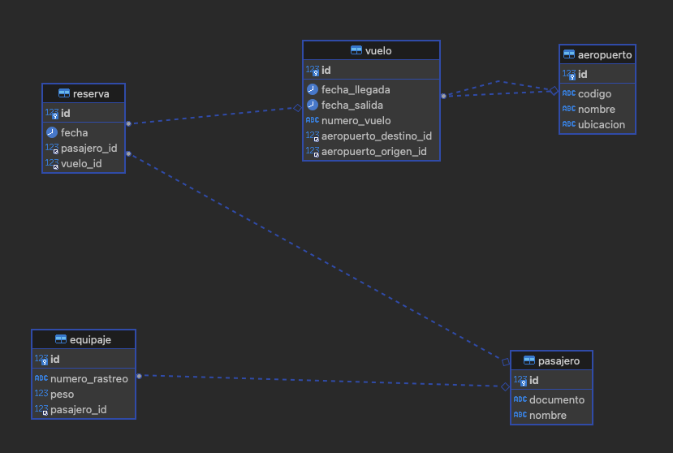

# Gestor de Aeropuerto

Este proyecto del aeropuerto es una aplicación de gestión que permite administrar aeropuertos, vuelos, pasajeros, reservas, equipaje y más. La aplicación utiliza el framework Spring Boot y una base de datos MySQL para almacenar y recuperar la información.

## Diagrama de la base de datos



## Configuración

Antes de ejecutar la aplicación, asegúrate de tener instalado lo siguiente:

- Java Development Kit (JDK) 8 o superior
- MySQL Server

## Configuración de la base de datos

1. Crea una base de datos en MySQL llamada `airport` (o el nombre que desees utilizar).
2. Verifica y actualiza la configuración de la base de datos en el archivo `application.properties` ubicado en la carpeta `src/main/resources`. Asegúrate de proporcionar el nombre de usuario y la contraseña correctos para acceder a tu base de datos.

## Ejecución de la aplicación

Para ejecutar la aplicación, sigue estos pasos:

1. Abre una terminal o línea de comandos.
2. Navega hasta la carpeta raíz del proyecto.
3. Ejecuta el siguiente comando para compilar y empaquetar el proyecto:
   ```shell
   mvn clean package
   ```

4. Una vez finalizado el proceso de empaquetado, ejecuta el siguiente comando para iniciar la aplicación:

    ```shell
    mvnw spring-boot:run
    ```

5. La aplicación se iniciará y estará disponible en `http://localhost:3000`.

## Uso de la aplicación

La aplicación proporciona endpoints CRUD (Crear, Leer, Actualizar, Eliminar) para las siguientes entidades:

- Aeropuerto
    - Ruta: `/aeropuertos`
- Equipaje
    - Ruta: `/equipajes`
- Pasajero
    - Ruta: `/pasajeros`
- Reserva
    - Ruta: `/reservas`
- Vuelo
    - Ruta: `/vuelos`

Puedes utilizar herramientas como Postman o cURL para realizar solicitudes HTTP a estos endpoints y realizar operaciones CRUD en las entidades correspondientes.

## Ejecución en herramientas IDE

También puedes ejecutar la aplicación en herramientas como Visual Studio Code o IntelliJ IDEA. Simplemente importa el proyecto en tu IDE preferido y ejecuta la clase `Application.java` ubicada en el paquete `com.tu.paquete`.

## Contribuciones

¡Las contribuciones son bienvenidas! Si deseas mejorar este proyecto, por favor, sigue los siguientes pasos:

1. Realiza un fork de este repositorio.
2. Crea una rama con el nombre de tu nueva función o mejora.
3. Realiza los cambios necesarios y realiza los commits.
4. Envía un pull request con tus cambios.

## Soporte

Si encuentras algún problema o tienes alguna pregunta, no dudes en abrir un "issue" en este repositorio.

## Autor
Este proyecto fue desarrollador por [Kevin Bayter](http://bcod3r.com).


